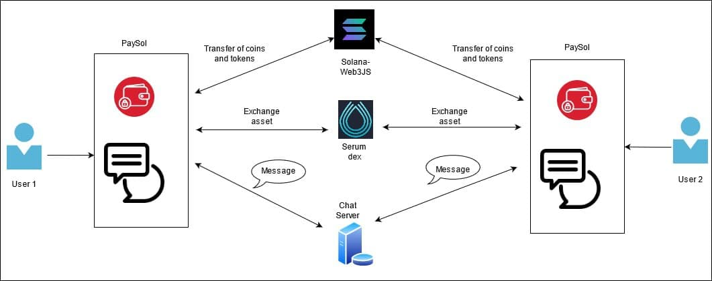

# PaySol
[](https://forthebadge.com)

## Project Description

PaySol strives to facilitate people or businesses to connect and transfer crypto assets easily through a scan and pay system to enable a secured and fast transfer.

### Features
- Web based non-custodial crypto wallet
- Enables secure and private 1:1 messaging
- Pay by scanning QR code
- Creating accounts KYC-free
- Zero transaction fee charged by PaySol

## Architecture



## Configuration

For running the Server, you need to create a `.env` file with the following fields:

```env
PUSHER_APPID = 
PUSHER_KEY = 
PUSHER_SECRET = 
PUSHER_CLUSTER = 

MONGO_CONNECTION_URL =
```

## Installation

To run this application locally, clone the GitHub repo using `https://github.com/srishilesh/PaySol.git`. Then, follow the instructions as mentioned below:

### Server

- To redirect to the `/server` folder:

```bash
cd server
```

- Install the packages:

```bash
npm install
```

- To run the server:

```bash
node server.js
```

- Alternatively, you use run `npm install -g nodemon` to keep the server running continously:

```bash
nodemon server.js
```

### Client
- To redirect to the `/client` folder:

```bash
cd client
```

- Install the packages:

```bash
npm install
```

- To run the client application:

```bash
npm run start
```

## Techstack
- [ReactJS](https://github.com/facebook/react)
- [NodeJS](https://github.com/nodejs)
- [MongoDB](https://github.com/mongodb/mongo)
- [Solana Web3js](https://solana-labs.github.io/solana-web3.js/modules.html)
- [Material-UI](material-ui.com)

## Way forward
- Multi-asset management
- Build reward programs for the users
- Build SPL token to redeem the rewards
- Enhancing the Chat UI
- Advertising products/services in the marketplace
- Subscription based billing and invoicing of payments
- Analytics and reports generation
- Building peer-to-peer system for messaging
- Connecting with Serum DEX

## Team
- [Srishilesh P S](https://github.com/srishilesh)
- [Harshak Krishna](https://github.com/Harshak777)
- [Bala Kumar S](https://github.com/balasbk)

## License
[Apache License 2.0](./LICENSE)
